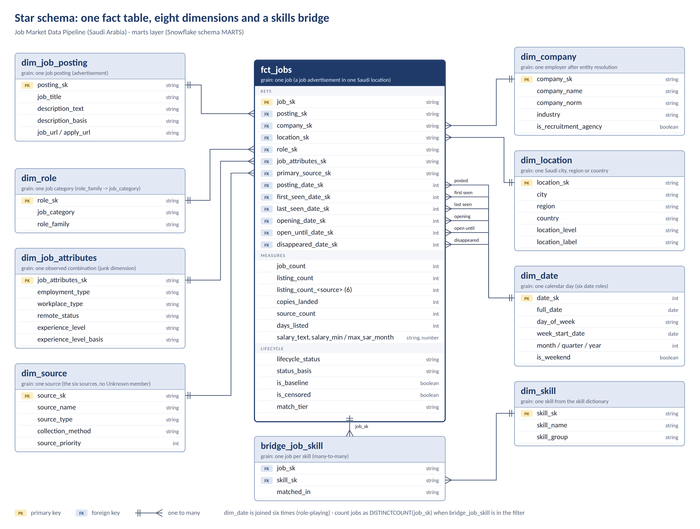
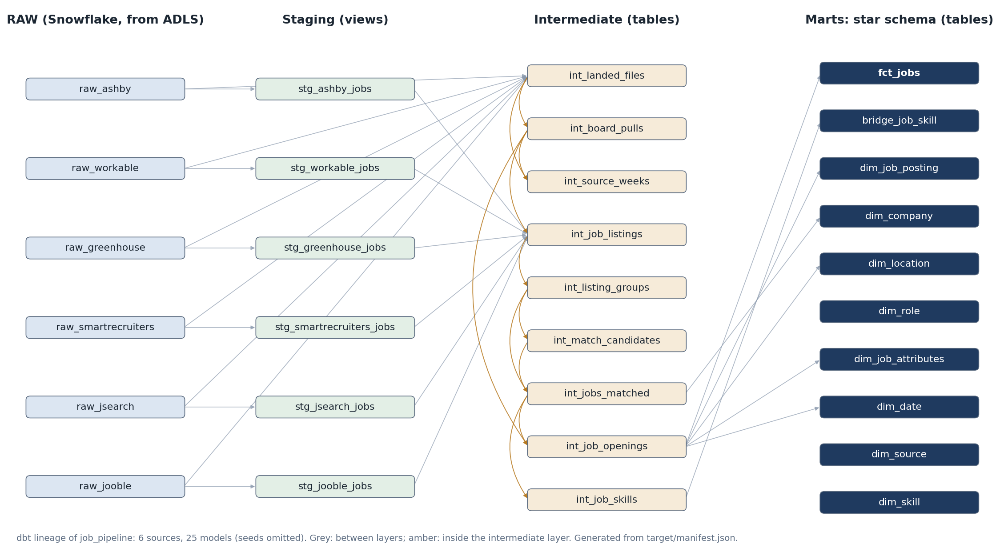

<!-- 02_code/README.md -->
# Saudi Job Market Data Pipeline: code, data and setup

Team A, SDA Data Engineering Bootcamp capstone (Project 2, Job Market Data Pipeline).

## 1. What the project does

A repeatable ELT pipeline that collects job postings for Saudi Arabia from six sources, lands them
untouched in Azure Data Lake Storage Gen2, loads them into Snowflake, and transforms them with dbt
into a tested star schema: one row per unique job after the same job published on several sources
has been merged.

```
Investigate  ->  Extract (Python)  ->  ADLS Gen2 raw/  ->  Snowflake RAW  ->  dbt  ->  MARTS  ->  Power BI
probes/          pipeline/             ingest_date=...     COPY INTO          staging -> intermediate -> marts
```

| Type | Sources | How data is collected |
|---|---|---|
| Employer job boards (ATS) | Workable, SmartRecruiters, Ashby, Greenhouse | One public API call per company board; each file is the board's Saudi postings at that pull |
| Query aggregators | Jooble, JSearch | Search APIs; coverage comes from a query matrix (cities, keywords, date windows) run until new results dry up |

17 candidate sources were evaluated; the decisions and reasons are in
[`02_src/source_investigation/source_investigation.md`](02_src/source_investigation/source_investigation.md).

**Data model.** `fct_jobs` (accumulating snapshot, six date roles) with eight dimensions and
`bridge_job_skill`. Grain of `fct_jobs`: one row per unique job advertisement in one Saudi location,
after the listings of the same job on several sources have been merged. Full specification, rules,
quality report and limitations: [`02_src/dbt/data_modeling/data_model.md`](02_src/dbt/data_modeling/data_model.md).





**Results of the final build** (data collected 9 to 28 September 2026): 20,490 listings merged into
19,148 unique jobs (1,203 by exact matching, 20 by fuzzy matching); 1,008 jobs (5.3%) found on more
than one source; 2,584 open and 177 disappeared jobs on employer boards; 174 new openings; 22,822
job-skill links. dbt build: 10 seeds, 25 models, 288 data tests, 323 passed, 0 warnings, 0 errors.

## Folder layout

```
02_code/
├── 01_data/
│   ├── final_datasets/     the ten MARTS tables as CSV, with row counts and columns (README inside)
│   └── data_samples/       real API responses from every source, used to design staging
├── 02_src/
│   ├── pipeline/           extraction scripts (one per source), landing to ADLS, run_pipeline.py
│   ├── dbt/                dbt project: staging, intermediate, marts, seeds, tests, analyses, data model
│   ├── snowflake/          warehouse, database, RAW tables, stages, roles and grants
│   ├── probes/             scripts that tested each aggregator's real behaviour before collection
│   └── source_investigation/
├── 03_assets/              star schema diagram, dbt lineage, screenshots
├── requirements.txt
├── .env.example
└── README.md               this file
```

Every folder under `02_src/` has its own README with the details: `pipeline/README.md`,
`dbt/README.md`, `dbt/DATA_QUALITY.md`, `pipeline/ingestion/collection_methodology.md`.

## 2. Required software

| Software | Version | Used for |
|---|---|---|
| Python | 3.11 or later (tested on 3.14, Windows) | Extraction, upload, pipeline runner |
| Python packages | pinned in `requirements.txt` | `requests`, `python-dotenv`, `azure-storage-blob`, `dbt-core` 1.12.3, `dbt-snowflake` 1.12.0 |
| dbt package | `dbt_utils` 1.4.1 (`02_src/dbt/packages.yml`) | Surrogate keys and generic tests |
| Snowflake account | any edition | RAW, STAGING, INTERMEDIATE, MARTS and SEEDS schemas |
| Azure Storage account | ADLS Gen2, containers `raw` and `curated` | Raw landing zone and curated export |
| Power BI Desktop | optional | Dashboard on MARTS, read-only role |

## 3. Install

From a terminal (the commands are PowerShell; on macOS or Linux use `cp` instead of `copy` and `/`
in paths):

```powershell
git clone https://github.com/RimazKhalid/job-data-pipeline.git
cd job-data-pipeline\02_code
pip install -r requirements.txt
copy .env.example .env
copy 02_src\dbt\profiles.example.yml 02_src\dbt\profiles.yml
cd 02_src\dbt
py -m dbt.cli.main deps
py -m dbt.cli.main debug          # must end with "All checks passed!"
cd ..
```

## 4. How to run

**One-time Snowflake setup**, in a Snowflake worksheet, in this order:

1. `02_src/snowflake/job_pipeline_snowflake.sql`: warehouse, database, RAW tables and the raw stage.
   Paste the read-only SAS of the `raw` container into the stage in the worksheet, never into the file.
2. `02_src/snowflake/roles_and_grants.sql`, part 1: the `JOB_PIPELINE_DEV` role used by dbt.
3. First build, from `02_code/02_src`: `py pipeline/run_pipeline.py --steps load build`
   (creates STAGING, INTERMEDIATE, MARTS and SEEDS).
4. `02_src/snowflake/roles_and_grants.sql`, part 2: the read-only `JOB_PIPELINE_REPORTER` role for Power BI.
5. `02_src/snowflake/curated_stage.sql`: the export target in the ADLS `curated` container.

**Every run**, from `02_code/02_src`:

```powershell
py pipeline/run_pipeline.py --dry-run                              # print the plan, run nothing
py pipeline/run_pipeline.py                                        # 4 ATS sources: extract -> ADLS -> COPY INTO -> freshness -> dbt build -> export
py pipeline/run_pipeline.py --steps load freshness build export    # rebuild from the files already in ADLS
```

A run stops at the first failed step, so ADLS `curated/` only receives a build whose blocking checks
passed (`02_src/dbt/DATA_QUALITY.md`). Each run is logged with its `run_id` in `raw/run_log.csv`.
The aggregator campaigns (Jooble, JSearch) run separately through
`02_src/pipeline/ingestion/<source>/matrix.py`, because of their request quotas.

**Business questions Q1 to Q9** are answered by `02_src/dbt/analyses/business_questions.sql` in a
Snowflake worksheet; the quality report comes from `pipeline_audit.sql`, `intermediate_checks.sql`
and `model_checks.sql` in the same folder.

**Without Snowflake**, the final dataset is in `01_data/final_datasets/` as CSV, with its columns
described in the README there.

## 5. API keys, environment variables and setup

All secrets live in `02_code/.env`, copied from `.env.example`. `.env` and `profiles.yml` are
ignored by git and must never be committed.

| Variable | Needed for | Where to get it |
|---|---|---|
| `JOOBLE_API_KEYS` | Jooble extraction | Free key from jooble.org/api; comma-separated for several keys (500 requests per key) |
| `JSEARCH_API_KEYS` | JSearch extraction | OpenWeb Ninja (api.openwebninja.com) free tier; comma-separated |
| `ADLS_ACCOUNT_NAME`, `ADLS_CONTAINER`, `ADLS_SAS_TOKEN` | Upload to ADLS | Azure portal, container SAS with Read, Add, Create, Write and List |
| `SNOWFLAKE_ACCOUNT`, `SNOWFLAKE_USER`, `SNOWFLAKE_PASSWORD` | dbt | Your Snowflake login; read by `02_src/dbt/profiles.yml` |
| `JOB_PIPELINE_RAW_DIR` | Optional | Local landing zone; default is a `raw/` folder next to the repository |

The four employer-board sources need no key. The dbt role `JOB_PIPELINE_DEV` must be granted to
your Snowflake user (`02_src/snowflake/roles_and_grants.sql`).

## 6. Limitations and known issues

Each limitation is measured in `data_model.md`, section 12. The main ones:

- **Lifecycle only for employer-board jobs.** 16,387 of 19,148 jobs come from aggregators only;
  a search result is not a full list, so their status is `unknown`.
- **One week with every source fully pulled** (27 and 28 September), so weekly trends before it
  can reflect collection rather than the market.
- **Raw ATS files hold only Saudi postings**: the scripts filtered them before saving. ATS folder
  dates are the UTC date of the run, so a pull after midnight Riyadh time carries the day before.
- **Matching is heuristic.** In the final build 1 of 20 fuzzy merges joins two different jobs and
  1 is uncertain; some jobs worded differently on two sources stay two jobs.
- **Sparse attributes.** Experience level is known for 39.1% of jobs, employment type for 35.2%;
  13.6% of jobs have no disclosed employer.
- **Aggregator quotas.** Jooble allows 500 requests per key for its lifetime, so a new aggregator
  campaign needs new keys; the default runner extracts the four employer boards only.
- **No schedule.** `run_pipeline.py` runs every step on demand; a scheduled Azure Data Factory
  pipeline was designed but not built.
