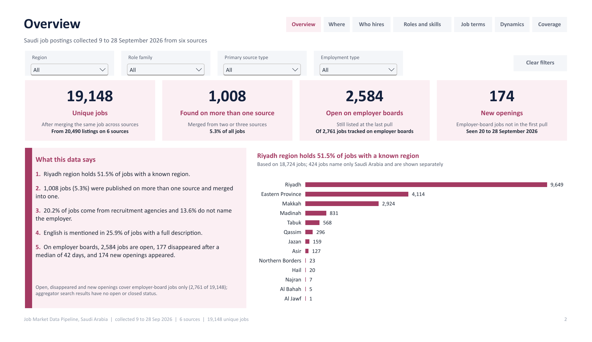

<!-- README.md -->
# Job Market Data Pipeline, Saudi Arabia (Group A)

SDA Data Engineering Bootcamp capstone, Project 2: Job Market Data Pipeline, scoped to Saudi Arabia.

## What we proposed

A repeatable pipeline that finds where Saudi job postings can be collected legally, collects them
from several sources, and turns them into one standardised, deduplicated dataset for job-market
analysis. The proposal is in [`01_proposal/`](01_proposal/).



## Results

| Measure | Value |
|---|---|
| Listings collected (after within-source deduplication) | 20,490 |
| Unique jobs after cross-source matching | 19,148 |
| Jobs found on more than one source | 1,008 (5.3%) |
| Employer-board jobs open / disappeared | 2,584 / 177 |
| New openings seen after the first pull | 174 |
| Final dbt build | 323 checks passed, 0 warnings, 0 errors |

The business questions, the data quality report and every measured limitation are in the data
model document, [`02_code/02_src/dbt/data_modeling/data_model.md`](02_code/02_src/dbt/data_modeling/data_model.md).

## What we built

An ELT pipeline on Python, Azure Data Lake Storage Gen2, Snowflake, dbt and Power BI:

- **Six sources:** four employer job boards (Workable, SmartRecruiters, Ashby, Greenhouse) and two
  job aggregators (Jooble, JSearch), chosen from 17 candidates.
- **Raw layer:** every pull landed unchanged in ADLS under `raw/<source>/ingest_date=YYYY-MM-DD/`
  and loaded into Snowflake with `COPY INTO`.
- **dbt:** 6 staging models, 9 intermediate models (standardisation, cross-source matching with an
  exact and a fuzzy tier, job lifecycle, skills) and a star schema of 10 tables, checked by 288
  data tests.
- **Curated dataset:** the ten mart tables, exported to ADLS as Parquet and to
  `02_code/01_data/final_datasets/` as CSV.
- **Dashboard:** an 8-page Power BI report on the marts
  ([`02_code/02_src/powerbi/`](02_code/02_src/powerbi/)).

## How to run it

Setup, keys, run commands and known issues: [`02_code/README.md`](02_code/README.md).

## Folder structure

```
Job_Market_Data_Pipeline_GroupA_v1/
├── 01_proposal/          Job_Market_Data_Pipeline_GroupA_Proposal_v2.pdf (document)
│                         Job_Market_Data_Pipeline_GroupA_Proposal_Presentation_v1.pdf (slides)
├── 02_code/
│   ├── 01_data/          final datasets (CSV) and sample API responses
│   ├── 02_src/           pipeline, dbt project, Power BI report, Snowflake scripts, probes, source investigation
│   ├── 03_assets/        star schema diagram, dbt lineage, data-quality and dashboard screenshots
│   ├── requirements.txt
│   └── README.md         setup and run instructions
├── 03_project_report/    Job_Market_Data_Pipeline_GroupA_Report_v1.pdf
└── 04_presentation/      Job_Market_Data_Pipeline_GroupA_Presentation_v1.pptx
                          README.md, with the link to the demo video (hosted on Google Drive, over 100 MB)
```

## Team

| Name | Main responsibilities |
|---|---|
| Rimaz Khalid Alghamdi | Repository owner; Ashby and Workable collection, Snowflake RAW layer, dbt setup and staging, pipeline runner, data-quality checks, curated container and exports |
| Shahd Aldukhayil | Source investigation, architecture, Jooble and JSearch collection, intermediate layer and matching, data model, final repository structure and dashboard |
| Ghadah BaniAli | Greenhouse collection, ADLS Gen2 setup and raw container, Azure Data Factory design |
| Azizah Alharbi | SmartRecruiters collection, source checks, testing and documentation, first Power BI dashboard |
